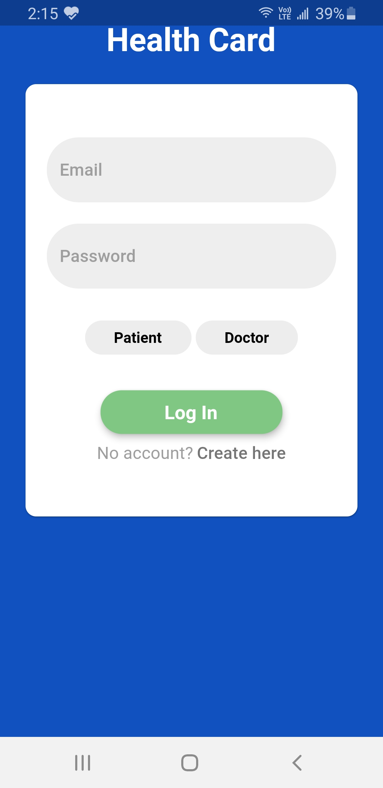
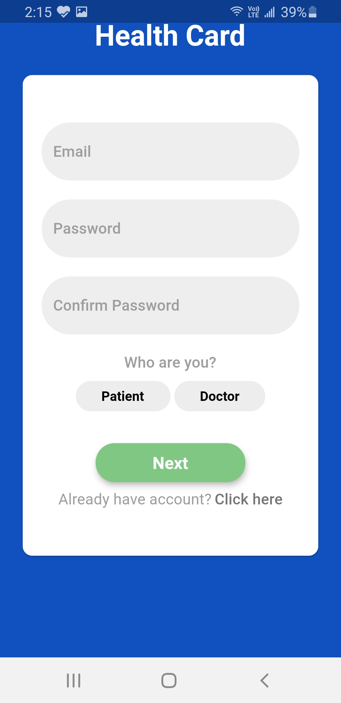
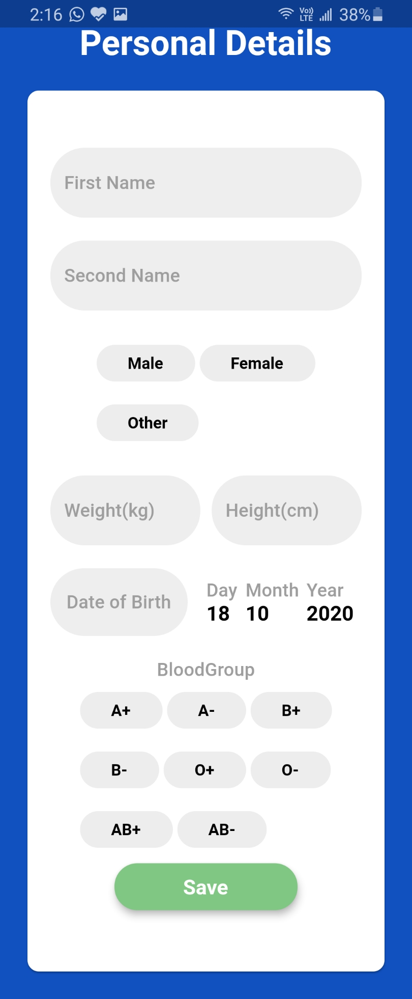
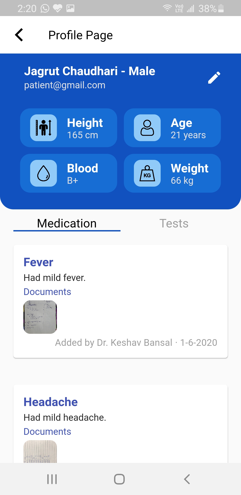
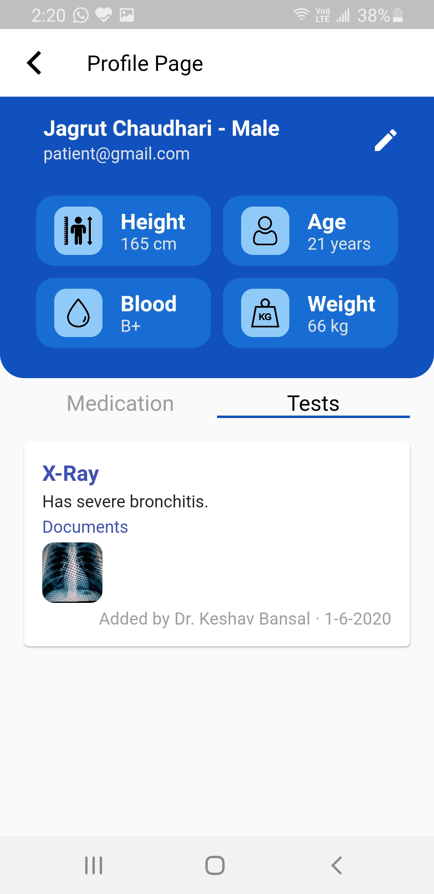

# health_card

An app for a patient and a doctor.

A patient can view his past medical history.

A doctor can view and add medical records of a patient using the QRcode from patient's phone.

  
  
  

  
  

